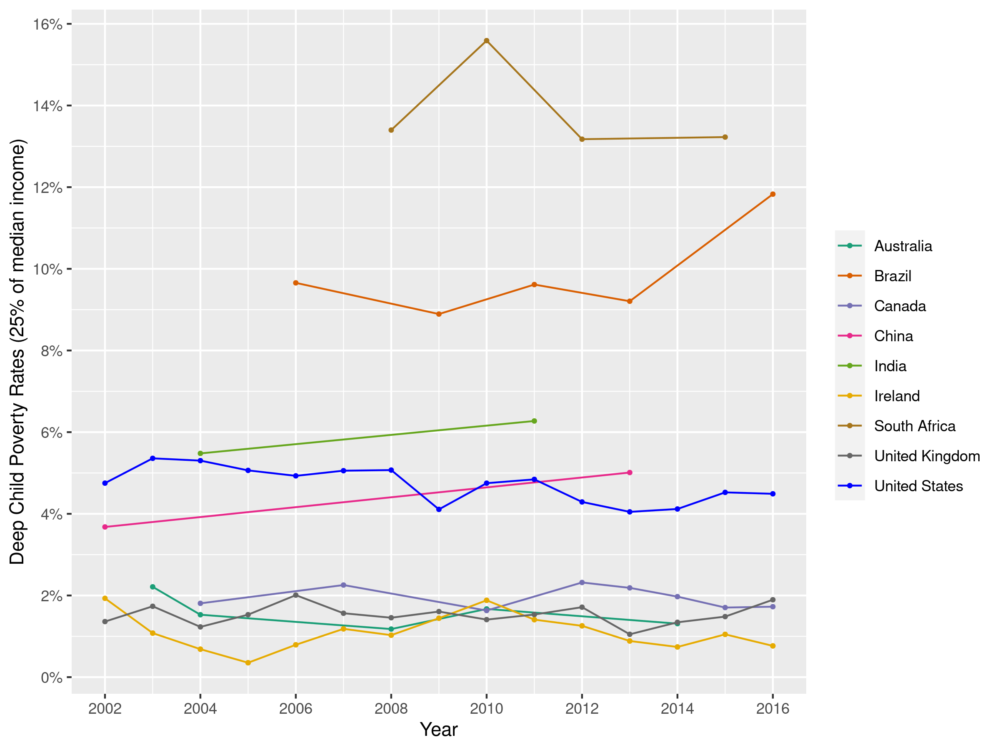
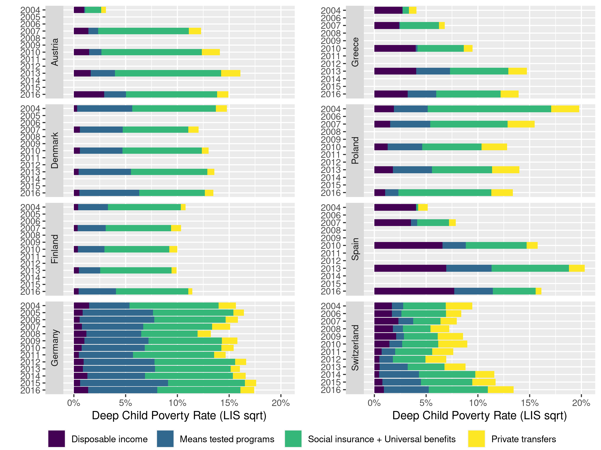

# Child poverty

Economics of distribution seminar paper based on Cai and Smeeding (2020) exploring absolute and relative child poverty levels in HICs and MICs.

## Replication
Our replication includes the LISSY `R` code to collect all data and prepare it for further data wrangling. We then create all plots for the original sample with the original equivalence scales and absolute poverty lines.

## Extension
Our extension includes extending the country sample of analysis, providing additional household equivalence scales, and providing absolute poverty numbers using the World Bank poverty lines (1.9, 3.2, and 5.5 USD a day).

